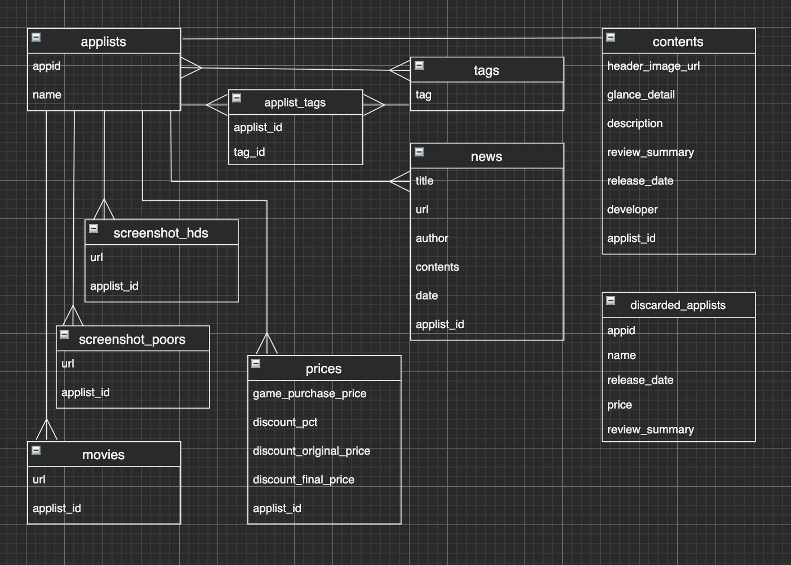

## アプリケーション名
SteamApp

## アプリケーション概要
Steamに登録されているアプリを検索して購入しやすくする価格比較サイト。

## URL
https://steam-app-36233.herokuapp.com/

## テスト用アカウント
Basic認証 
ID: admin 
Pass: 4805

## 利用方法
トップページに、Steamに登録されているアプリ一覧が表示される。 
キーワードやタグを入力して、アプリを検索できる。 
アプリ一覧は、レビュー評価順・割引率順・リリース日順に並び替えることが出来る。 
アプリ欄をクリックすると、詳細画面に遷移してスクリーンショットやニュースが確認できる。 
購入したい場合は、StoreボタンをクリックするとSteamのストアページに遷移する。

## 目指した課題解決
Steam利用者(6000万人/日,2020年度)のために、本家サイトで不足してる機能を補った価格比較サイトSteamAppを作成した。 
Steam URL: https://store.steampowered.com/?l=english 
 
SteamAppの具体的な機能は、キーワード検索・タグ検索を組み合わせた検索機能と、セール履歴の保存機能である。 
普段Steamを利用していて不便なのが、検索機能がお粗末なことと、セール履歴が残らないことだった。 
そのため、上記の欠点を補った価格比較サイトを、趣味と実益を兼ねて作成した。 
 
SteamAppの詳細な改善点は、キーワード検索・タグ検索機能を組み合わせて使用出来るようになっている。 
また、アプリ一覧表示画面にタグ一覧を表示しているので、類似したアプリを辿って検索しやすくなっている。 
アプリ一覧表示画面をレビュー評価順・割引率順などで並び替えられるようになっている。 
アプリ詳細画面に、アプリの過去と現在の価格情報をグラフ表示するようになっている。

## 洗い出した要件
Steam-API 
Webスクレイピング 
アプリ一覧表示 
アプリ詳細表示 
キーワード検索 
タグ検索 
価格履歴 
ページネーション 
ニュース履歴 
Webスクレイピングの定期実行

## 実装した機能についての画像やGIFおよびその説明
### Steam-API 
Steam-APIからJSON形式で、Steam内に登録されているアプリのID・タイトル名のリストが入手できるので、配列を整形してデータベースに保存する

***

### Webスクレイピング 
nokogiriというWebスクレイピング用のgemを利用して、ストアページのタグ・クラス名などを標的に、必要なデータを抽出してデータベースに保存する

***

### アプリ一覧表示 
アプリのヘッダー画像、価格、セール情報、ユーザーレビュー、紹介文など購買動機に影響する情報を、アプリごとに一覧表示する

***

### アプリ詳細表示 
アプリ一覧表示画面で確認できる情報に加えて、スクリーンショットのサムネイルや、現在と過去の価格情報、最近のニュース情報をアプリごとに表示する

***

### キーワード検索 
ransakというgemを利用して、入力されたキーワード情報から、タイトル名が一致するアプリを、データベース内からあいまい検索する

***

### タグ検索 
ransakというgemを利用して、アプリに紐付いたタグ情報から、同様のタグで紐付いているアプリを、データベース内から完全一致検索する

***

### 価格履歴 
chartkickというgemを利用して、アプリの過去と現在の価格情報をグラフ表示する

***

### ページネーション 
kaminariというgemを利用して、トップページでアプリを20件ずつ一覧表示する

***

### ニュース履歴 
Steam-APIを利用して、JSON形式でニュースのリストを取得する

***

### Webスクレイピングの定期実行 
Heroku Schedulerを利用して、Webスクレイピングの処理を定期実行する

## 実装予定の機能
Webスクレイピングのコードを洗練させる (Herokuはクエリ発行数に制限があるため、Webスクレイピングと相性が悪い)
レビューの詳細表示 (現在はレビューの総評のみ掲載しているため)
アプリ詳細表示画面に動画を掲載 (未掲載のため)
広告表示機能 (収益化のため)

## データベース設計

## ローカルでの動作方法
git clone <https://steam-app-36233.herokuapp.com/> 
cd steam-app-36233 
bundle install 
yarn install 
rails db:create 
rails db:migrate 
rails s